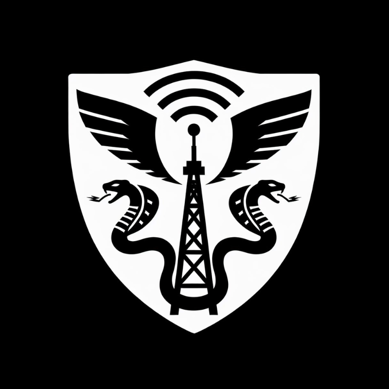

  

# Hi, I’m Brian 👋  

🚀 **DevOps-driven problem solver** focused on **automation, visibility, and scalable systems**.  
I build lean, AI-enhanced project flows that make it easy for teams to stay aligned and hard for details to get lost.  

💡 My work bridges **AV show control experience** (Crestron, integrated systems) with modern **DevOps practices**, turning field-tested workflows into digital automation engines.  

---

## 🔧 What I Do  
- **Automation Architect** → replacing bottlenecks with intelligent pipelines  
- **Workflow Designer** → surfacing blockers instantly to kill the noise
- **System Builder** → connecting the dots between hardware integration and software control  

---

## ⚡ Current Projects  
- 🦑 **Leviathan** → AI-powered AV sales & ops automation engine  
- 📊 **Ops Dashboard** → turning sticky-note chaos into real-time clarity  
- 🧩 **GitHub Labs** → sharpening my DevOps edge one commit at a time  

---

## 📫 Connect with Me  
- 🌐 [Portfolio Website](https://brianblack.ai) _(soon)_  
- 💼 [LinkedIn](https://www.linkedin.com/in/brian-black-tpm)  
- 🛠️ GitHub (you’re here)  

---

## ⚙️ Philosophy  
> *“Anything worth doing is hard. My value is cutting through the noise, finding a way forward, and delivering when it matters.”*  
