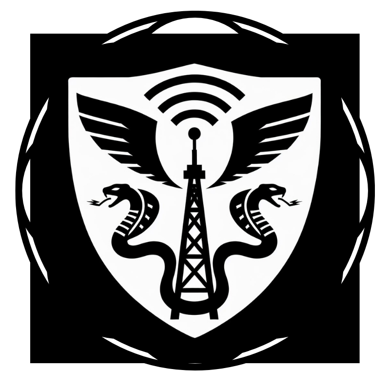

  

# Hi, I’m Brian 👋

🚀 **Technical systems builder focused on automation, operational intelligence, and scalable workflows.**

I turn messy real-world operations into structured systems that are easier to understand, automate, and scale.

💡 My work bridges **20+ years of AV and live-production experience** with modern software architecture, AI-assisted development, cloud infrastructure, and DevOps practices.

---

## 🔧 What I Do

- **Systems Architect** → translating operational reality into deterministic software
- **Automation Builder** → replacing bottlenecks and manual handoffs with intelligent workflows
- **Technical Program Manager** → aligning product vision, architecture, implementation, and execution
- **Domain Expert** → bringing field-tested AV and production judgment into software design

---

## ⚡ Current Projects

- 🌊 **BidWave** → deterministic AV quoting and labor intelligence engine built around one principle: **Reality Before Pricing**
- 📡 **Ops Watch** → CI/CD uptime monitoring with automated health checks and Slack alerting
- 🧠 **AI-Assisted Engineering Systems** → exploring how human domain expertise and specialized AI collaborators can build governed, explainable software

---

## 🌊 Building BidWave

BidWave began as a spreadsheet-driven AV estimating system.

It has evolved into a multi-domain software platform that models operational reality before deriving labor and pricing.

Current domains:

- Audio
- Video
- LED Wall

The project now includes:

- deterministic labor modeling
- cross-domain crew consolidation
- operational review advisories
- multi-tenant architecture
- full-stack quote workflows
- 579+ automated tests
- Executive Decision Records (EDRs)
- a formal AI-assisted governance model

**The goal is not to automate judgment. It is to encode good judgment into systems that can explain themselves.**

---

## 🧭 How I Build

**Reality → Model → Logic → Automation → Outcome**

I believe:

- operational truth should come before software convenience
- explainability beats black-box cleverness
- automation should remove friction, not human judgment
- architecture should preserve the *why*, not just the *what*
- AI works best as a specialized collaborator, not a magic button

---

## 🛠️ Working With

**Product & Engineering**

Next.js · React · Python · APIs · GitHub Actions · Vercel

**Cloud & Automation**

AWS · GCP · CI/CD · Slack · Google Sheets API · Resend · Zapier · Make

**Operations & Delivery**

Technical Program Management · Systems Architecture · Workflow Design · AV Production

---

## 📬 Connect with Me

- 🌐 **Portfolio:** brianblack.ai
- 💼 **LinkedIn:** brian-black-tpm
- 🐙 **GitHub:** You’re already here

---

## ⚙️ Philosophy

> Build systems that make it easy for teams to stay aligned—and hard for important details to get lost.

Currently building at the intersection of **domain expertise, deterministic software, and AI-assisted engineering.**

---

## ⚙️ Philosophy  
> *“Anything worth doing is hard. My value is cutting through the noise, finding a way forward, and delivering when it matters.”*  
